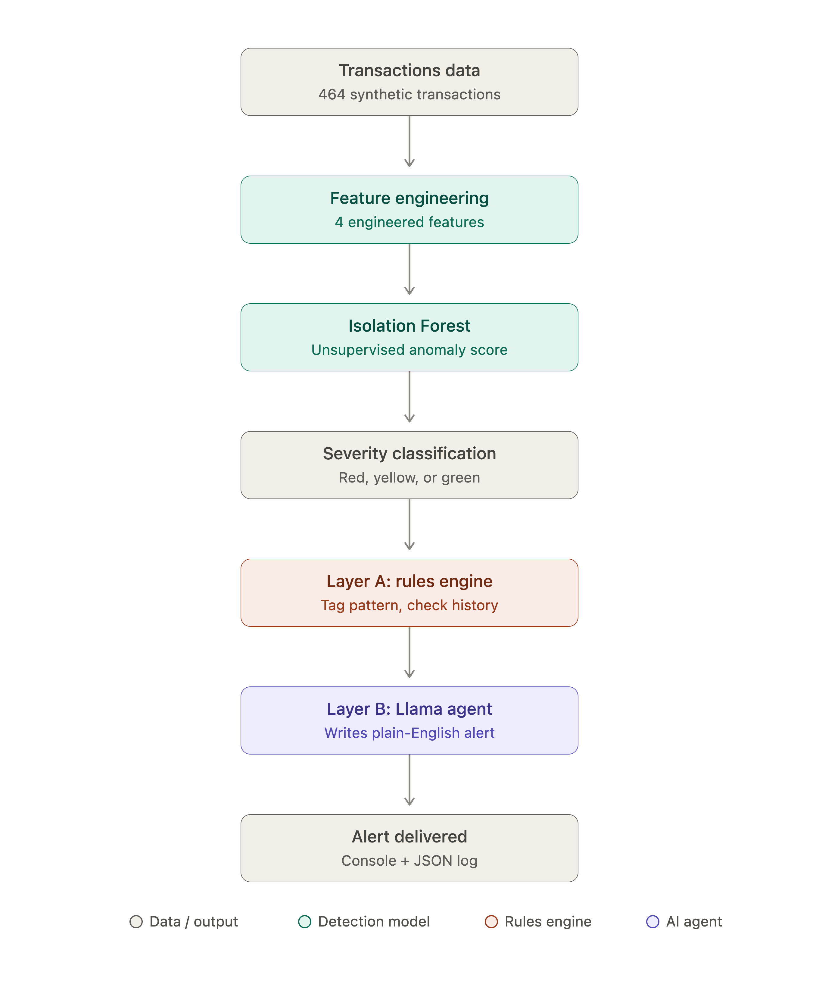
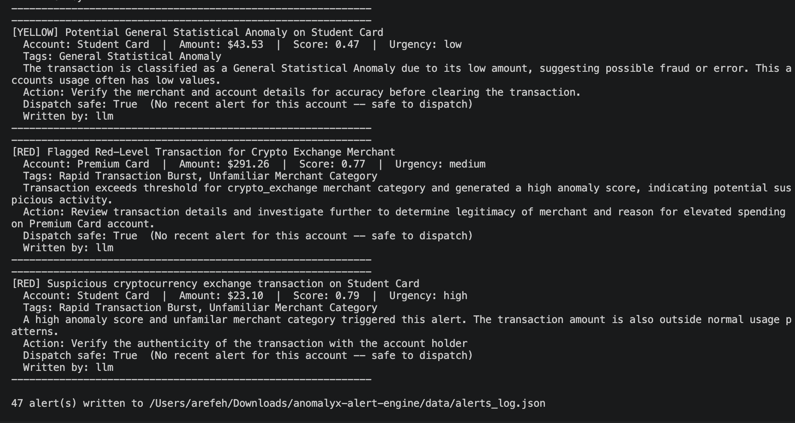

# AnomalyX Alert Engine

A small end-to-end fraud detection pipeline: an Isolation Forest flags
anomalous bank transactions, and a two-layer AI agent turns each flagged
transaction into a plain-English alert for a fraud analyst.



## What it does

1. **Detects anomalies.** Four simple features per transaction — how far
   the amount is from the account's rolling 30-day average, how many
   transactions the account made in the last hour, whether it happened
   overnight, and whether the merchant category is one the account
   normally uses — feed an Isolation Forest, which scores every
   transaction and buckets it into **Red / Yellow / Green**.

2. **Explains itself with a two-layer agent.**
   - **Layer A (Python, deterministic):** a small rules engine tags *why*
     a transaction was flagged (e.g. "Large Amount Deviation", "Rapid
     Transaction Burst"), checks whether this account already had a
     recent alert (so a burst of 4 transactions doesn't produce 4
     alerts), and decides `dispatch_safe` — **in Python, never by the
     LLM**.
   - **Layer B (a local Llama model via Ollama, or a template if Ollama
     isn't running):** takes that context and writes the actual alert —
     headline, explanation, recommended action, urgency. Everything runs
     on your machine — no API key, no cost, no data leaving your laptop.

## Setup

```bash
pip install -r requirements.txt

# Install Ollama (one-time, free): https://ollama.com/download
ollama pull llama3.2

python run_pipeline.py
```

Works even if Ollama isn't installed or running — Layer B just uses the
template instead. Run `python src/generate_data.py` any time to
regenerate the synthetic dataset.

```bash
python run_pipeline.py --max-alerts 3   # cap alerts (useful while testing)
pytest tests/ -v                        # 12 tests
```

## Sample output




Real output from `python run_pipeline.py` with Ollama running — the
`headline` and `explanation` text below is written by Llama 3.2, not a
template:


[RED] High-Severity Transaction with Unusual Anomaly Score
Account: Student Card  |  Amount: $67.44  |  Score: 0.94  |  Urgency: high
Tags: Off-Hours Activity, Unfamiliar Merchant Category
The transaction is a withdrawal of $67.44 from the Student Card account,
which has an unusual anomaly score of 0.938, indicating potential
suspicious activity.
Action: Verify if the account holder intended to withdraw this amount
and confirm the merchant category matches.
Dispatch safe: True  (No recent alert for this account -- safe to dispatch)
Written by: llm


[YELLOW] Potential General Statistical Anomaly on Student Card
Account: Student Card  |  Amount: $43.53  |  Score: 0.47  |  Urgency: low
Tags: General Statistical Anomaly
The transaction is classified as a General Statistical Anomaly due to
its low amount, suggesting possible fraud or error. This account's
usage often has low values.
Action: Verify the merchant and account details for accuracy before
clearing the transaction.
Dispatch safe: True  (No recent alert for this account -- safe to dispatch)
Written by: llm


## Results (this synthetic demo dataset)

Full run against all 464 transactions, 47 alerts generated:

| | |
|---|---|
| Recall | **100%** (42/42) — every injected anomaly was flagged |
| Precision | **62.7%** (42/67) — about 1 in 3 alerts is a false positive |
| False negatives | **0** |

That trade-off is expected and honest: catching everything means also
catching some legitimately unusual (but not fraudulent) spending. A real
deployment would tune the Red/Yellow thresholds in `src/detector.py`
against a cost model (false alert vs. missed fraud) rather than chase 100%
on both.


## Project structure

```
run_pipeline.py       # the whole pipeline, start to finish
src/
  generate_data.py    # synthetic accounts + transactions with injected anomalies
  features.py          # 4 features: spend_ratio, txn_count_1h, is_night, merchant_mismatch
  detector.py           # Isolation Forest + Red/Yellow/Green thresholds
  agent.py               # Layer A (rules engine) + Layer B (Llama via Ollama / template)
  alerter.py               # console formatting, JSON log, burst dedup, eval
tests/test_pipeline.py       # 12 tests
```
